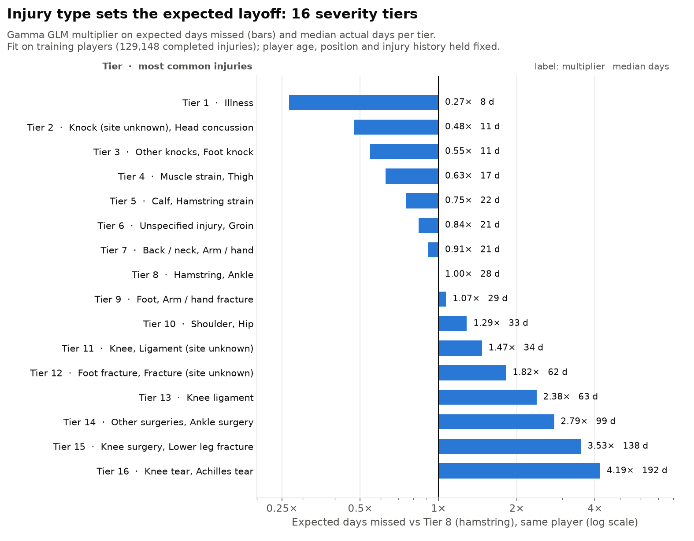

# Model Results

This page covers the probabilistic part of an injury insurance pricing model for professional soccer players. For one player and one season it gives the chance of any injury, of a **covered** injury (longer than the deferment period, 60 days by default) and of a **career-ending** injury.

Data: Transfermarkt injuries, player profiles and playing time ([salimt/football-datasets](https://github.com/salimt/football-datasets)). Every model is tested on players held out of fitting (80/20 split by player).

## Key findings

- **The season probabilities are calibrated.** On 6,086 held-out big-five player-seasons the model predicts 54.2% with an injury (actual 52.8%) and 11.9% with an injury over 60 days (actual 12.1%).
- **The model separates low-risk from high-risk players.** Ranked by predicted risk, the lowest tenth has a 3.8% actual chance of a covered injury and the highest tenth 19.9%. Every tenth is within about 3 points of its prediction.
- **Injury history drives frequency.** Each log unit of prior injuries multiplies expected injuries by 1.53. Goalkeepers have 0.63 times the rate of midfielders.
- **The deferment matters a lot.** For a typical player, the chance of a covered injury falls from 23% with a 30-day deferment to 11% at 60 days, 6% at 90 days and 2% at 180 days.
- **Career-ending injuries are rare:** about 0.2% of player-seasons. Knee and Achilles injuries, surgery, age and little recent playing time raise the risk most.
- **Fit on the insured population.** When severity was first fit on injuries in all leagues, covered injuries were over-predicted 1.44 times. Big-five injuries are recorded as shorter on average, because minor knocks are recorded more completely there. The probabilities are calibrated only once each piece is fit on the population being priced.

---

## The pricing formula

```text
λ = expected injuries this season            negative binomial GLM, dispersion α
q = P(an injury lasts more than D days)      tiered gamma GLM, averaged over the injury mix
c = P(an injury ends the career)             logistic GLM, averaged over the injury mix

P(at least one injury)          = 1 − (1 + αλ)^(−1/α)
P(at least one covered injury)  = 1 − (1 + αλq)^(−1/α)
P(career-ending injury)         = 1 − (1 + αλc)^(−1/α)
```

- The type of a future injury is unknown. So q and c are weighted averages over body region and injury type cells, using each cell's share of insured injuries as the weight.
- If each injury independently has probability q of being covered, covered injuries are again negative binomial with mean λq and the same α ("thinning"). This assumes an injury's type and length don't depend on how many injuries the player has.
- Inputs: age, position, league, minutes last season, career minutes, prior injuries, days out last season and the date. Missing inputs take typical values.
- Code: `model/pricing.py` (`quote`, `combine`). Back-test: `runs/pricing_model.ipynb`.

---

## Season back-test

All models are fit on training players only. The held-out set is 6,086 big-five player-seasons of 1,956 players. Each season is described by what was known at its start.


| Season probability | Predicted | Actual | Ratio |
|---|---|---|---|
| At least one injury | 0.542 | 0.528 | 1.03 |
| At least one injury > 30 days | 0.243 | 0.253 | 0.96 |
| At least one injury > 60 days | 0.119 | 0.121 | 0.98 |
| At least one injury > 90 days | 0.070 | 0.073 | 0.97 |
| At least one injury > 180 days | 0.024 | 0.028 | 0.86 |
| Career-ending injury (4,814 seasons with known follow-up, 7 events) | 0.0021 | 0.0015 | 1.44 |

**Covered injury (> 60 days) by predicted-risk decile:**

| Decile | 1 | 2 | 3 | 4 | 5 | 6 | 7 | 8 | 9 | 10 |
|---|---|---|---|---|---|---|---|---|---|---|
| Predicted | 4.2% | 6.3% | 7.5% | 8.7% | 10.3% | 12.1% | 13.9% | 15.8% | 18.1% | 22.5% |
| Actual | 3.8% | 5.6% | 9.4% | 11.2% | 13.0% | 13.0% | 12.8% | 15.3% | 17.4% | 19.9% |

**Any injury by decile:** predicted 21% to 86%, actual 14% to 86%, every decile within about 7 points.

**Career-ending:** only 7 events, so read this as indicative. The riskiest 20% of player-seasons contain 4 of the 7. The career model is fit on all leagues and over-predicts slightly in the big five.

**By league (> 60 days, predicted vs actual):** Premier League 14.4% vs 17.1%, LaLiga 10.4% vs 10.2%, Serie A 11.6% vs 10.5%, Bundesliga 14.6% vs 15.5%, Ligue 1 9.0% vs 7.8%.

---

## Example quotes (60-day deferment)

From `python -m model.pricing`. All models are fit on all data.

| Player | Expected injuries λ | P(any injury) | P(covered injury) | P(career-ending) |
|---|---|---|---|---|
| 27-year-old Premier League defender, 2,500 min last season, 15,000 career min, 4 prior injuries | 1.00 | 59% | 15.6% | 0.25% |
| 33-year-old defender, 2,200 min, 45,000 career min, 10 prior injuries (league defaults to Serie A) | 1.44 | 71% | 13.3% | 0.88% |
| 22-year-old Bundesliga attacker, 1,500 min, 5,000 career min, 1 prior injury | 0.87 | 55% | 10.0% | 0.08% |

The 33-year-old has more injuries but a lower covered-injury chance than the 27-year-old. This is mostly a league effect: Serie A records more and shorter injuries than the Premier League. A covered injury lasts 122 to 137 days on average for these players.

## Deferment sensitivity

A typical held-out player-season: 25-year-old Serie A defender, 1,898 minutes last season, 2 prior injuries (λ = 1.04, P(any injury) = 61%, P(career-ending) = 0.21%). Models fit on training players.

| Deferment | P(an injury lasts longer) | P(covered injury this season) | Average length of a covered injury |
|---|---|---|---|
| 30 days | 26.4% | 23.5% | 77 days |
| 60 days | 11.2% | 10.9% | 125 days |
| 90 days | 6.2% | 6.2% | 167 days |
| 180 days | 1.9% | 1.9% | 264 days |

---

## Frequency: expected injuries per season

**Model:** negative binomial (NB2) GLM, log link. The population is every player in a big-five first-division squad (Premier League, LaLiga, Serie A, Bundesliga, Ligue 1), seasons 2015/16 to 2024/25: 30,240 player-seasons, 9,887 players, 1.03 injuries per season on average (variance 1.74, so overdispersed; α ≈ 0.22). Smaller leagues barely record injuries, so they are left out. All predictors are known at the season start.

```text
log E[injuries] = league + position + age + age² + log(1 + full games last season) + no games last season
                  + log(1 + prior injuries) + log(1 + days out last season)
```

**Held-out players:**

| | No predictors | Poisson GLM | Negative binomial GLM | Actual |
|---|---|---|---|---|
| Log-likelihood per season | −1.399 | −1.281 | **−1.267** | |
| Mean absolute error | 0.980 | 0.854 | **0.854** | |
| Share of seasons with no injury | 0.468 | 0.426 | **0.458** | 0.472 |

By decile, expected injuries run from 0.25 (actual 0.19) to 2.53 (actual 2.33).

**Rate ratios** (multiplier on expected injuries; baseline: 26-year-old Premier League midfielder):

| Predictor | Rate ratio |
|---|---|
| **log(1 + prior injuries)** | **1.53** per unit |
| log(1 + full games last season) | 1.23 per unit |
| log(1 + days out last season) | 1.08 per unit |
| Goalkeeper / defender / attacker (vs midfielder) | 0.63 / 1.05 / 1.09 |
| LaLiga / Serie A / Bundesliga / Ligue 1 (vs Premier League) | 0.98 / 1.34 / 1.36 / 0.89 |
| Age | small; peaks in the mid-20s |

League rate ratios partly reflect how completely each league records injuries.

---

## Severity: how long an injury lasts

**Model:** gamma GLM, log link, on severity tiers. Each injury gets a rating class (body region × injury type). Neighbouring classes are merged into tiers until adjacent tiers differ significantly (p < 0.05).

```text
log E[days missed] = severity tier + position + age + age² + log(1 + prior injuries)
                     + re-injury within 60 days + prior injury to the same body part
```

**All-league model** (`runs/severity_models.ipynb`, 163,414 injuries to 34,429 players). On held-out players the mean absolute error is 33.3 days, against 44.0 with no predictors. The injury dominates. The same body part injured before adds 9%, a re-injury within 60 days adds 3%, and position and age matter little.



The tier table is fit on training players and has 16 tiers. The all-data fit in the notebook has 17 tiers, because it separates knee tears from Achilles tears.

| Tier | Multiplier vs Tier 8 | Median days | Examples |
|---|---|---|---|
| 1 | 0.27 | 8 | Illness |
| 2 | 0.48 | 11 | Concussion, knocks |
| 3 | 0.55 | 11 | Foot and other knocks |
| 4 | 0.63 | 17 | Ankle ligament, muscle strains, thigh |
| 5 | 0.75 | 22 | Calf and hamstring strains |
| 6 | 0.84 | 21 | Groin, muscle tears |
| 7 | 0.91 | 21 | Arm/hand, back/neck |
| 8 | 1.00 | 28 | Hamstring/ankle (unspecified), calf tear |
| 9 | 1.07 | 29 | Arm/hand fracture, foot |
| 10 | 1.29 | 33 | Shoulder, hip, ankle tear |
| 11 | 1.47 | 34 | Knee (unspecified), shoulder fracture |
| 12 | 1.82 | 62 | Foot fracture, groin surgery |
| 13 | 2.38 | 63 | Knee ligament |
| 14 | 2.79 | 99 | Ankle surgery, other fractures and surgeries |
| 15 | 3.53 | 138 | Knee surgery, lower-leg fracture |
| 16 | 4.19 | 192 | Knee and Achilles tears |

**Pricing version.** For q, the same model is refit on the insured injuries only: those starting in a big-five season from 2015/16. It adds a league term, because leagues record injury length differently. Expected days relative to the Premier League are LaLiga 0.84×, Serie A 0.69×, Bundesliga 0.74× and Ligue 1 0.88×. Only 13% of these injuries last over 60 days, against 21% in all leagues. The per-injury mode of `model.predict` uses this version, which has fewer tiers.

---

## Career-ending: chance an injury ends the career

**Model:** logistic GLM. "Career-ending" means no professional appearance in any later season and no return within the injury's season, with at least two seasons of follow-up. It is fit on all leagues: 120,682 injuries, 504 career-ending (0.42%). The big-five seasons have only about 25 career-ending injuries. Only information known on the injury date is used.

```text
logit P(career-ending) = body region + injury type + position + age + age² + log(1 + prior injuries)
                         + re-injury within 60 days + prior injury to the same body part
                         + log(1 + games, last 12 months) + no games, last 12 months
                         + log(1 + career games) + year
```

**Held-out players:** AUC 0.857 (0.50 with no predictors). The riskiest 10% of injuries contain 55% of the career endings.


**Odds ratios** (all-data fit, `runs/career_ending_model.ipynb`; the figure shows the training-player fit):

| Predictor | Odds ratio |
|---|---|
| **Knee / Achilles** (vs hamstring) | **10.9 / 10.9** |
| **Surgery / tear / fracture** (vs unspecified) | **3.3 / 2.9 / 2.4** |
| **Age** | 1.29 per year around 26 |
| Defender / attacker (vs midfielder) | 1.34 / 0.75 |
| log(1 + games, last 12 months) | 0.55 per unit: regular players are far less likely to retire |
| log(1 + career games) | 0.78 per unit |
| log(1 + prior injuries) | 0.74 per unit |
| Year | 1.07 per year (likely data coverage) |

---

## Limitations

- **Big five only.** Frequency and severity are fit on big-five first-division seasons, where recording is dense. The model should not be applied to other leagues as is.
- **Recording practice.** League effects mix real risk with how each league records injuries. Injuries Transfermarkt misses (minor knocks especially) are missing here too, and prior-injury counts are undercounted for older players.
- **Independence.** The thinning formula assumes injury count, type and length are independent. Frequently injured players actually have somewhat shorter injuries. The league term removes part of this, and the rest is small at season level.
- **Career-ending is inferred** from appearances, so dropping to amateur football counts. The career model comes from all leagues, and the big-five back-test rests on 7 events.
- **Part seasons.** A player who joins or leaves the big five mid-season counts as one full season.
- **Patterns, not causes.** The coefficients describe associations in the data.
- **Probabilities only.** A simple expected cost would be P(career-ending) × sum insured + expected covered injuries × average days beyond the deferment × daily benefit.
