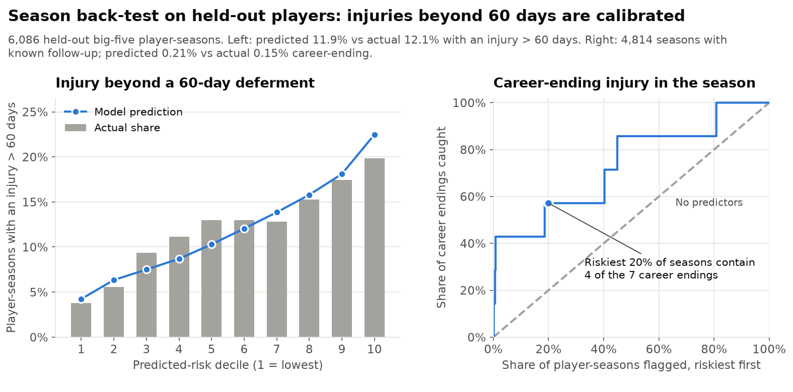

# Soccer Injury Insurance: Probability Model

The probabilistic part of an injury insurance pricing model for professional soccer players. Cover pays only for injuries that last longer than a deferment period (60 days by default), so for one player and one season the model gives three numbers:

1. the chance of **any injury**,
2. the chance of a **covered injury** (one lasting more than the deferment),
3. the chance of a **career-ending injury**.

All three come from simple GLMs (negative binomial, gamma, logistic) fitted on Transfermarkt data, and they are back-tested on players held out of fitting.

## Headline results

Season back-test on 6,086 held-out big-five player-seasons (Premier League, LaLiga, Serie A, Bundesliga, Ligue 1; 2015/16 to 2024/25). All models are fit on training players only.

| Season probability | Predicted | Actual |
|---|---|---|
| At least one injury | 54.2% | 52.8% |
| At least one injury > 60 days (**covered**, default deferment) | 11.9% | 12.1% |
| Career-ending injury | 0.21% | 0.15% (7 events) |

Covered-injury risk is also calibrated across deferments: 24.3% vs 25.3% at 30 days, 7.0% vs 7.3% at 90 days, 2.4% vs 2.8% at 180 days. Ranked by predicted risk, the lowest tenth of players has a 3.8% actual chance of a covered injury and the highest tenth 19.9%. The model predicts 4.2% and 22.5% for those groups.



## How the pieces fit

```text
λ  expected injuries this season       negative binomial GLM  (model/frequency.py)
q  P(an injury lasts > deferment)      gamma GLM              (model/severity.py)
c  P(an injury ends the career)        logistic GLM           (model/career.py)

P(any injury)          = 1 − (1 + αλ)^(−1/α)
P(covered injury)      = 1 − (1 + αλq)^(−1/α)      covered injuries:       λ × q per season
P(career-ending)       = 1 − (1 + αλc)^(−1/α)      career-ending injuries: λ × c per season
```

The type of a future injury is unknown, so q and c are averaged over the mix of injuries players actually have. α ≈ 0.22 is the negative binomial dispersion. `model/pricing.py` combines the three models.

## Try a quote

```bash
python -m model.predict --age 27 --position Defender --league "Premier League" \
    --minutes-last-season 2500 --career-minutes 15000 --prior-injuries 4
```
```
Expected injuries this season: 1.00
Chance of at least one injury: 59%
Chance of at least one injury lasting more than 60 days (covered): 16%
  expected covered injuries: 0.173; a covered injury lasts 137 days on average
Chance of a career-ending injury this season: 0.25%
Chance a given injury lasts more than 30 / 60 / 90 / 180 days: 38% / 17% / 10% / 3.59%
Filled in with typical values: days out last season = 0
```

Use `--deferment 90` to change the deferment period. Any input you leave out gets a typical value, and the output lists it. To quote many players: `python -m model.predict --csv runs/example_players.csv --out quotes.csv`. For one injury that has already happened (days out and career-ending chance), use `--injury "Broken foot"`.

## Where to go next

1. **[MODEL_SUMMARY.md](MODEL_SUMMARY.md)**: all results on one page (drivers, back-test tables, example quotes, deferment sensitivity).
2. **[MODEL_EQUATIONS.md](MODEL_EQUATIONS.md)**: the three fitted equations with every predictor and coefficient, and how they combine.
3. **[runs/pricing_model.ipynb](runs/pricing_model.ipynb)**: the season back-test that the headline numbers come from.
4. The three components:
   - [runs/frequency_model.ipynb](runs/frequency_model.ipynb): how many injuries per season,
   - [runs/severity_models.ipynb](runs/severity_models.ipynb): how long an injury lasts,
   - [runs/career_ending_model.ipynb](runs/career_ending_model.ipynb): whether an injury ends a career.

## The components

- **Frequency** (negative binomial GLM): expected injuries per player-season from league, position, age, games last season, prior injuries and days out last season. It is fit on 30,240 big-five player-seasons (9,887 players, 1.03 injuries per season on average). Prior injuries are the strongest driver, and goalkeepers have about a third fewer injuries.
- **Severity** (tiered gamma GLM): expected days out. The tiers group injuries by body part and type, from illness (about 8 days) to knee and Achilles tears (about 190 days). For pricing it is refit on the insured injuries (big-five seasons) with a league term.
- **Career-ending** (logistic GLM): the chance an injury ends a career, from body part, injury type, age, position, recent and career playing time and prior injuries. It is fit on all leagues, because big-five seasons contain only about 25 career-ending injuries. On held-out injuries the AUC is 0.857, and the riskiest 10% of injuries contain 55% of the career endings.

## Limitations

- **Big five only.** Transfermarkt records injuries densely only in the top five leagues, so the model should not be applied to other leagues as is.
- **Recorded, not true, injuries.** League effects partly reflect how each league records injuries. For example, the Premier League records fewer but longer injuries.
- **Independence assumption.** The formulas assume an injury's type and length don't depend on how many injuries the player has. In fact, frequently injured players have somewhat shorter injuries.
- **Career-ending is inferred** from appearances: a player with no later professional appearance counts as career-ended. Big-five seasons have few such events, so that back-test is only indicative.
- **Probabilities only.** Cost is not modelled. A simple expected cost would be P(career-ending) × sum insured + expected covered injuries × average days beyond the deferment × daily benefit.

## Reproduce

The data is a MySQL database, `sports_injury`, built from Transfermarkt files ([salimt/football-datasets](https://github.com/salimt/football-datasets)). Run everything from the repository root.

```bash
pip install -r requirements.txt
mysql -u root -e "CREATE DATABASE sports_injury CHARACTER SET utf8mb4"
git clone https://github.com/salimt/football-datasets data/football-datasets
(cd data/football-datasets && git lfs pull)
python -m database.build_db data/football-datasets

python -m model.frequency     # held-out results for each component
python -m model.severity
python -m model.career
python -m model.pricing       # example quotes and calibration check
python -m runs.make_figures   # regenerates runs/figures/
```

The code connects to `mysql+pymysql://root@localhost/sports_injury`. Set `SPORTS_DB_URL` to use another server. The first `model.predict` run fits all models and caches them in `model/fitted/`. Run `python -m model.predict --refit` after reloading the data.

## Files

| Path | What it is |
|---|---|
| [MODEL_SUMMARY.md](MODEL_SUMMARY.md) | Full results. |
| [MODEL_EQUATIONS.md](MODEL_EQUATIONS.md) | The fitted equations and coefficient tables. |
| **model/** | |
| [model/frequency.py](model/frequency.py) | Negative binomial GLM: expected injuries per season. |
| [model/severity.py](model/severity.py) | Tiered gamma GLM: days out per injury. |
| [model/career.py](model/career.py) | Logistic GLM: chance an injury ends the career. |
| [model/pricing.py](model/pricing.py) | Combines the three into season probabilities (`quote`). |
| [model/predict.py](model/predict.py) | Command line: season quotes, or one injury; single or CSV. |
| **runs/** | |
| [runs/pricing_model.ipynb](runs/pricing_model.ipynb) | Season back-test of the combined model. |
| [runs/frequency_model.ipynb](runs/frequency_model.ipynb) | Frequency results and coefficients. |
| [runs/severity_models.ipynb](runs/severity_models.ipynb) | Severity results, coefficients and tier mapping. |
| [runs/career_ending_model.ipynb](runs/career_ending_model.ipynb) | Career-ending results and coefficients. |
| [runs/backtest.py](runs/backtest.py) | Back-test code used by the notebook and figures. |
| [runs/make_figures.py](runs/make_figures.py) | Regenerates [runs/figures/](runs/figures/). |
| [runs/example_players.csv](runs/example_players.csv), [runs/example_injuries.csv](runs/example_injuries.csv) | Example inputs for `--csv`. |
| **database/** | |
| [database/build_db.py](database/build_db.py) | Loads the Transfermarkt files into MySQL. |
| [database/sportsdb.py](database/sportsdb.py) | Reads the database into pandas. |
| [requirements.txt](requirements.txt) | Python packages. |
