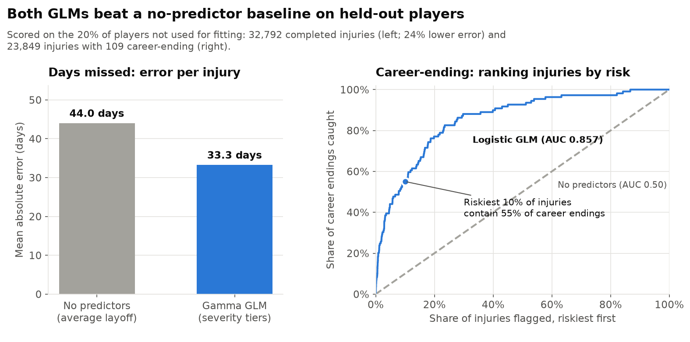
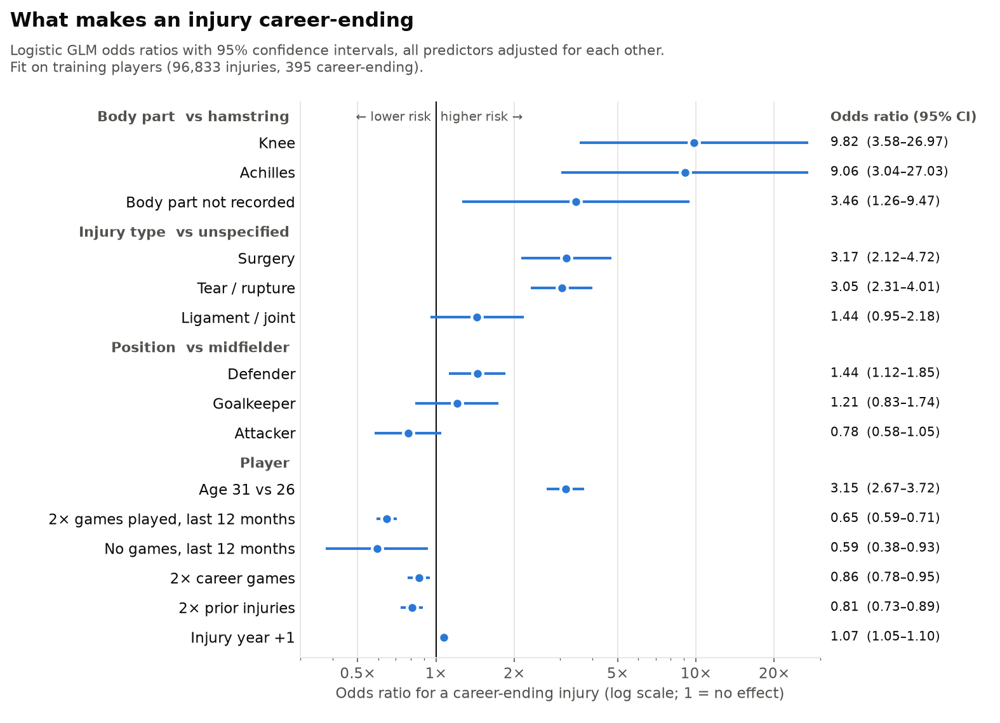

# Soccer Injury Models

Two GLMs that price a professional soccer injury: how many days it keeps the player out (gamma GLM), and the chance it ends their career (logistic GLM). Fitted on 163,414 injuries to 34,429 players from Transfermarkt, and tested on players held out of training.

## Headline results

| | Baseline (no predictors) | GLM |
|---|---|---|
| Days missed: mean absolute error | 44.0 days | **33.3 days** |
| Career-ending: AUC | 0.50 | **0.857** |
| Career-ending: share caught in the riskiest 10% of injuries | 10% | **55%** |

- **Injury type drives length.** Severity tiers run from 0.27x the days of a hamstring injury (illness, median 8 days) to 4.19x (Achilles and knee tears, median 192 days).
- **Career-ending injuries are rare** (504 of 120,682, about 1 in 240), but knee and Achilles injuries carry roughly 9-10x the odds of a hamstring injury, and age and little recent playing time raise the risk further.


## Where to go next

- **[MODEL_SUMMARY.md](MODEL_SUMMARY.md)**: full results, the severity tier pricing table, all drivers and a plain-language explanation.
- **[severity_models.ipynb](severity_models.ipynb)**: the gamma GLM coefficients (variable, coef, p-value) and which injuries fall in each severity tier.
- **[career_ending_model.ipynb](career_ending_model.ipynb)**: the logistic GLM coefficients (variable, coef, p-value).
- **[predict.py](predict.py)**: describe an injury and get a prediction.

```bash
python predict.py --injury "Cruciate ligament tear" --age 27 --position Defender \
                  --minutes-last-12-months 2500 --career-minutes 15000 --prior-injuries 4
```
```
Read as: Tear / rupture — Knee  (rating class 'Knee - Tear / rupture', Tier 16 of 17, higher = longer)
Expected time out: 160 days
Likely range: half of similar injuries take under 157 days, 3 in 4 under 214, 9 in 10 under 275
Chance of missing more than 90 days: 73%;  more than 180 days: 39%
Chance this injury ends the career: 2.03%  (average injury: about 0.42%)
Filled in with typical values: nothing
```

For many injuries at once: `python predict.py --csv example_injuries.csv --out predictions.csv` (only `age` and `injury` are required). Missing inputs get the median player's value, and the output lists what was filled in. `predict.py` fits on all the data, so its tier count can differ from the held-out run in `severity.py`.

## The models

```text
# Severity: days missed (severity.py)
days_missed ~ severity_tier + position + age + age² + log(1+prior injuries)
              + reinjury_60d + prior_same_part
family = Gamma, link = log            # exp(coef) = multiplier on days

# Career-ending: yes/no (career.py)
career_ending ~ body_region + injury_type + position + age + age² + log(1+prior injuries)
                + reinjury_60d + prior_same_part + log(1+games, 12m) + no_games_12m
                + log(1+career games) + year
family = Binomial, link = logit       # exp(coef) = odds ratio
```

- **Severity tiers:** each injury gets a rating class (body region x injury type, pooled to at least 300 injuries). Neighbouring classes are merged until adjacent tiers differ significantly (p < 0.05), using training players only.
- **Career-ending** means the player never made another recorded professional appearance after the injury. Only predictors known on the day of the injury are used, not how long it lasted.
- **Testing:** 80% of players train, 20% test; all of a player's injuries stay on one side.

## Results



**Severity drivers** (multiplier on expected days): the severity tier dominates (0.27x to 4.19x). Same body part injured before adds 9%, a re-injury within 60 days of returning adds 3%, and position and age matter little.



**Career-ending drivers** (odds ratios): knee 9.8x and Achilles 9.1x vs. hamstring; surgery 3.2x and tear 3.0x; 1.27x per year of age around 26; defenders 1.44x vs. midfielders; players with more games in the last 12 months are much less likely to have their career end (0.53x per log unit).

Full tables are in [MODEL_SUMMARY.md](MODEL_SUMMARY.md).

## Limitations

- **Soccer only:** results may not carry over to other sports.
- **Patterns, not causes:** for example, players with more recorded injuries have shorter ones, likely a reporting difference across leagues.
- **Career-ending is inferred** from appearances, so dropping to amateur football counts as career-ending.
- **Body part is keyword-matched** from the injury description; 18% are "unknown injury".

## Reproduce

The data is a MySQL database, `sports_injury`, holding injuries, player profiles and playing time from Transfermarkt (via [salimt/football-datasets](https://github.com/salimt/football-datasets)).

```bash
pip install -r requirements.txt
mysql -u root -e "CREATE DATABASE sports_injury CHARACTER SET utf8mb4"
git clone https://github.com/salimt/football-datasets data/football-datasets
(cd data/football-datasets && git lfs pull)
python build_db.py data/football-datasets

python severity.py       # held-out comparison and coefficients
python career.py
python predict.py --injury "Broken foot" --age 30
```

The scripts connect to `mysql+pymysql://root@localhost/sports_injury`; set `SPORTS_DB_URL` to use another server. The first `predict.py` run fits and saves the models to `models/` (about a minute); `python predict.py --refit` refits after reloading data.

## Files

| File | What it is |
|---|---|
| [MODEL_SUMMARY.md](MODEL_SUMMARY.md) | Full model results and drivers. |
| [severity_models.ipynb](severity_models.ipynb) | Gamma GLM coefficients and the severity tier mapping. |
| [career_ending_model.ipynb](career_ending_model.ipynb) | Logistic GLM coefficients. |
| [severity.py](severity.py) | Severity model: builds the data, the severity tiers, fits the gamma GLM and compares it with the baseline. |
| [career.py](career.py) | Career-ending model: fits the logistic GLM and compares it with the base rate. |
| [predict.py](predict.py) | Predictions for injuries you describe, one at a time or from a CSV. |
| [example_injuries.csv](example_injuries.csv) | Example input for `predict.py --csv`. |
| [figures/](figures/) | The charts on this page. |
| [make_figures.py](make_figures.py) | Regenerates the figures. |
| [build_db.py](build_db.py) | Data loading: loads the downloaded Transfermarkt files into MySQL. |
| [sportsdb.py](sportsdb.py) | Data loading: reads the database into pandas for the models. |
| [requirements.txt](requirements.txt) | Python packages. |
